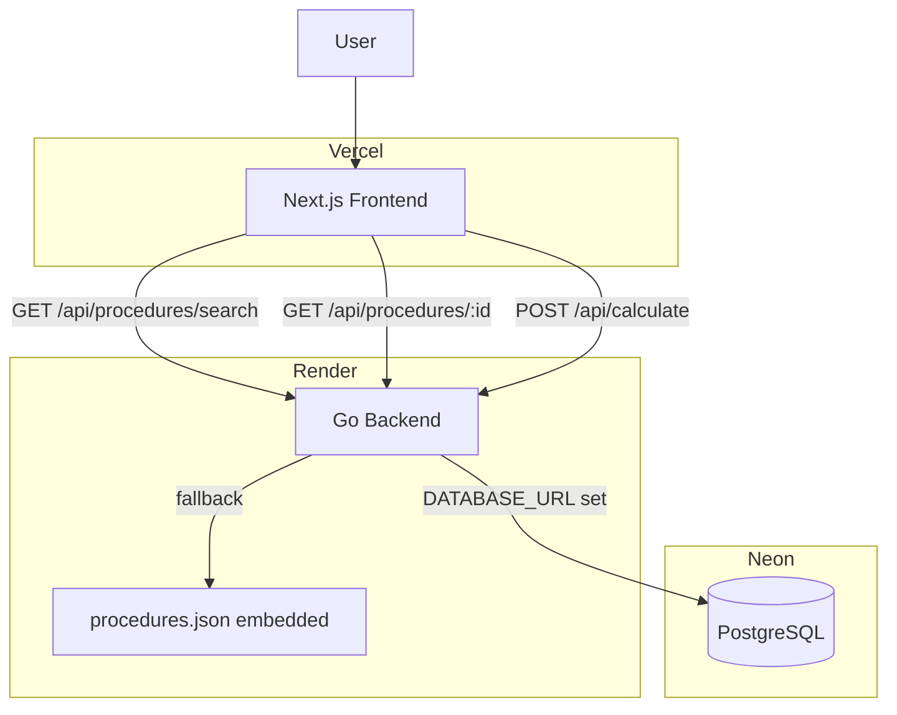

# Afere Architecture

## Overview

Afere is a deterministic medical procedure pricing platform built around the correct **SBN 1:N CBHPM** domain model. One SBN surgical package maps to multiple CBHPM billable codes. Physicians compose a bill by selecting which codes to include and at what porte, then receive a real-time breakdown.

See [domain-model.md](domain-model.md) for the full domain concepts, ER diagram, and calculation rules.

The system is composed of:

- Next.js frontend (Vercel)
- Go backend (Render)
- Embedded procedure catalog (procedures.json, fallback)
- PostgreSQL via Neon (production data layer)

## High-Level Architecture



## Components

### Frontend

Responsibilities:

- Search SBN procedures (debounced, accent-insensitive)
- Display all associated CBHPM codes with checkboxes and porte selectors
- Real-time valuation as composition changes
- Share a calculation via URL
- Render a shared calculation from URL params

### Backend

Responsibilities:

- Search SBN procedures (text + code + description match)
- Return procedure detail with all mapped CBHPM codes
- Execute multi-code billing calculations (pure functions, no I/O)
- Environment-aware: Neon if `DATABASE_URL` is set, embedded JSON otherwise

### Data Layer

Responsibilities:

- Store the SBN → CBHPM 1:N mapping catalog (Neon/PostgreSQL)
- Provide fallback catalog via embedded `procedures.json`
- Store porte values (seeded via migration 002)

## Backend Package Layout

```
backend/
  cmd/api/main.go          entry point; env-aware repo selection
  internal/
    config/                reads DATABASE_URL + PORT env vars
    models/                domain types
    repository/            interface + file + postgres implementations
    service/               pure calculation functions
    handlers/              HTTP handlers + routes
    generated/             openapi.gen.go (hand-maintained, matches openapi.yaml)
  db/
    migrations/            001_schema, 002_seed_portes, 003_seed_procedures
    query.sql              canonical SQL for PostgresRepository
```