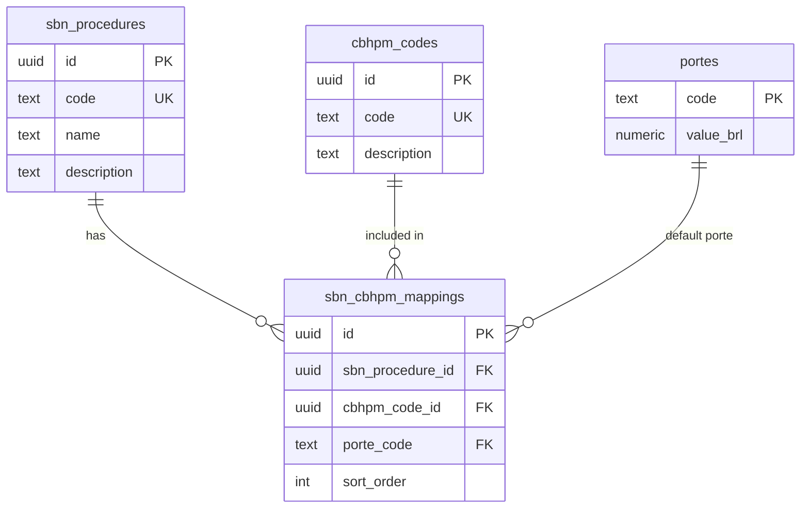

# Domain Model — Afere

## Business Context

Afere is a medical billing calculator for neurosurgeons in Brazil. Physicians bill insurance companies using the **CBHPM** table (Classificação Brasileira Hierarquizada de Procedimentos Médicos). However, the **SBN** (Sociedade Brasileira de Neurocirurgia) groups related CBHPM codes into named surgical packages for practical use.

One SBN surgical package maps to **one or more** CBHPM billable codes. A complete bill typically includes the primary procedure code plus one or more complementary codes (anesthesia setup, positioning, imaging guidance, etc.). Each code is billed at a specific **porte** (complexity class), which determines its monetary value.

---

## Domain Concepts

| Concept | Description |
|---|---|
| **SBN Procedure** | A named surgical package as published by the SBN. Has a code and a human-readable name. |
| **CBHPM Code** | A billable line item from the national procedure table. Has a code, description, and default porte. |
| **Porte** | A complexity class (e.g. `7A`, `8B`) with a fixed BRL value defined by CBHPM 2025/2026. |
| **Mapping** | The link between one SBN procedure and one CBHPM code, including the default porte and display order. |
| **Composition** | A physician's selection of which CBHPM codes to include in a bill, with per-code porte overrides. |
| **Valuation** | The monetary breakdown of a composition: per-code values + surgeon/auxiliary/anesthesia fees. |

---

## Why 1:N is Required

The original model assumed each SBN procedure maps to exactly one CBHPM code. This was wrong:

- A craniotomy, for example, maps to the main surgical code *plus* a neuronavigation code, a positioning code, and an ICU setup code.
- Each of those codes can have a different default porte.
- Physicians may uncheck codes that aren't applicable for a specific patient or payer.
- Per-code porte may need overriding (e.g., a payer-specific contract changes the porte for code X).

The correct model: **SBN 1 → N CBHPM**.

---

## Database Schema

```
sbn_procedures
  id          UUID PK (gen_random_uuid())
  code        TEXT UNIQUE NOT NULL         -- e.g. "1.1"
  name        TEXT NOT NULL                -- e.g. "CONSULTA GERAL - CRÂNIO"
  description TEXT
  created_at  TIMESTAMPTZ DEFAULT now()

cbhpm_codes
  id          UUID PK (gen_random_uuid())
  code        TEXT UNIQUE NOT NULL         -- e.g. "1.01.01.01-2"
  description TEXT NOT NULL
  created_at  TIMESTAMPTZ DEFAULT now()

portes
  code        TEXT PK                      -- e.g. "7A"
  value_brl   NUMERIC(10,2) NOT NULL       -- e.g. 858.03

sbn_cbhpm_mappings
  id                UUID PK
  sbn_procedure_id  UUID FK → sbn_procedures.id
  cbhpm_code_id     UUID FK → cbhpm_codes.id
  porte_code        TEXT FK → portes.code
  sort_order        INT DEFAULT 0
  UNIQUE (sbn_procedure_id, cbhpm_code_id)
```

### ER Diagram



---

## API Flows

### Search flow

```
GET /api/procedures/search?q=cranio
  → [{ id, name }]           ← SBNProcedureResult[]
```

Search is accent-insensitive. Matches against procedure name, CBHPM code numbers, and CBHPM descriptions.

### Detail flow

```
GET /api/procedures/{id}
  → { id, name, cbhpm_codes: [{ code, description, porte }] }
```

Returns all CBHPM codes linked to this SBN procedure, ordered by `sort_order`.

### Calculation flow

```
POST /api/calculate
  body: {
    selected_codes: [{ cbhpm_code, description, porte }],
    auxiliaries_count: int,
    requires_anesthesia: bool
  }
  → {
    code_breakdown: [{ cbhpm_code, description, porte, base_value }],
    total_base,
    lead_surgeon_fee,
    auxiliaries_fee,
    anesthesiologist_fee,
    final_total
  }
```

---

## Calculation Rules (CBHPM 2025/2026)

```
total_base          = Σ porteValues[code.porte]  for all selected codes

lead_surgeon_fee    = total_base × 1.00
auxiliaries_fee     = total_base × (0.30 + 0.20 × max(0, count-1))
                      (1st aux = 30%, 2nd–4th each = 20%)

anesthesiologist_fee = 1200.00  (fixed, if requires_anesthesia)

final_total         = lead_surgeon_fee + auxiliaries_fee + anesthesiologist_fee
```

---

## Frontend Flow

```
Search box
  │  (user types ≥2 chars → debounced GET /api/procedures/search)
  ▼
Dropdown → user selects SBN procedure
  │  (GET /api/procedures/{id})
  ▼
CBHPM code list (all pre-checked, each with porte selector)
  │  (user checks/unchecks codes, changes portes, adjusts staffing)
  ▼
Real-time calculation  (debounced 150ms → POST /api/calculate)
  │
  ▼
Right panel: per-code breakdown + surgeon/aux/anesthesia + total
  │
  ▼
Share button → copies URL:
  /share?sbn={id}&codes={code1}:{porte1},{code2}:{porte2}&a={n}&an={0|1}
```

---

## Backend Architecture

```
cmd/api/main.go
  └── config.Load()                   reads DATABASE_URL, PORT
  └── repository.NewPostgresRepository()   (if DATABASE_URL set)
      or repository.NewFileRepository()    (fallback: embedded JSON)
  └── handlers.RegisterRoutes(mux, repo)

internal/
  config/         env config
  models/         domain types (SBNProcedure, CBHPMCode, ProcedureWithCodes, …)
  repository/     interface + file-based + postgres implementations
  service/        calculator.go — pure functions, no I/O
  handlers/       HTTP handlers (search, procedure, calculate, health)
  generated/      openapi.gen.go — hand-maintained to match openapi.yaml v2.0.0
```

---

## Future Expansion

- **ETL pipeline**: `data/generate_catalog.py` generates `003_seed_procedures.sql` from the SBN PDF, populating `sbn_procedures`, `cbhpm_codes`, and `sbn_cbhpm_mappings`.
- **Payer-specific portes**: Add a `payer_porte_overrides` table to store negotiated porte values per payer per CBHPM code.
- **Procedure versioning**: Add `effective_from` / `effective_until` to mappings to handle CBHPM table updates over time.
- **Multi-procedure bills**: Allow composing multiple SBN procedures in a single calculation session (e.g., a combined craniotomy + vascular procedure).
